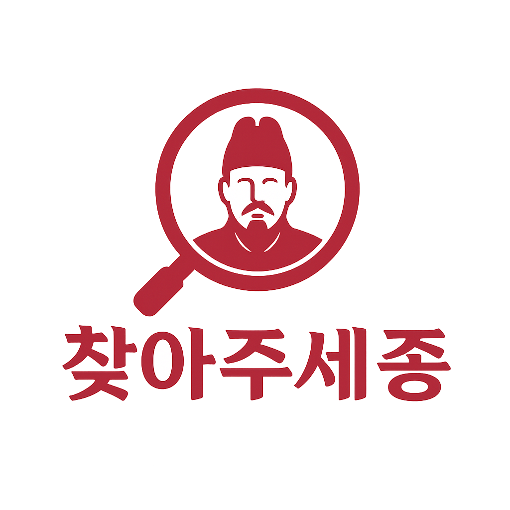

<!-- Please ensure the secret METRICS_TOKEN is added in your GitHub repository settings for GitHub Metrics to work -->

# 안녕하세요!
  

 

**김민지**라고 합니다 ...   
**돈가스와 도라에몽**을 좋아해요  
 

## 🧑‍💻 About Me

- 🎓 Double majoring in **Electronic and Information Communication Engineering** and **Software Engineering** at **Sejong University**  
- 🧑‍🎓 Currently a senior (4th year) undergraduate student  
- 🤖 Deeply interested in **CV(Computer Vision)**, **backend development**, and the overall field of **software engineering**  
- 📫 Contact: **arenran02@naver.com**   
 

## 📖 Career

✓ 2022.02 : graduated from Bopyung High School  
✓ 2022.03 ~ : undergraduate in Sejong University, major in Electronic Information Communication Engineering  
✓ 2024.03 ~ : double major in Software Engineering at Sejong University  
✓ 2024.08 ~ 2025.02 : IoT Supporter in COSS (혁신융합대학)  
✓ 2024.01 ~ 2024.12 : executive member of Sejong Univ Badminton Club 세콕세콕  
✓ 2024.03 ~ 2024.12 : executive member of Electronic Information Communication   Engineering Academic Club 프롬프트  
✓ 2024.01 ~ 2025.01 : undergraduate researcher in AISL Lab  
✓ 2025.09 ~ 2025.12 : internship in Beyless  

 

## ⚙️ Tech Stack

### 💻 Programming Languages

---

### 🧰 Frameworks / Libraries

---

### 🗄️ Database

---

### 🚀 DevOps & Tools

---

### 🖥️ OS

 

## 🏆 Awards

### 2025 제 12회 세종대학교 SW•AI 해커톤 - 은상🥈

  

 

## 💡 Projects 

### 캡스톤 디자인 (2025-1) - AI 유실물 관리 시스템  

[경찰청 유실물 포털의 Open API](https://www.data.go.kr/data/15058696/openapi.do?recommendDataYn=Y)를 활용하여 데이터를 수집하고, **데이터셋 구성 및 정제**  
수집한 데이터셋을 기반으로 [CLIP](https://github.com/openai/CLIP)을 파인튜닝하여, 입력된 **물건 이미지로부터 유사한 물건 이름과 설명을 추출**  
[DINOv2](https://github.com/facebookresearch/dinov2) 모델에서 추출한 이미지 벡터 정보를 [MongoDB](https://www.mongodb.com/)에 저장하고, 이를 기반으로 한 **이미지 매칭 및 알림 시스템(top-k)** 을 구축  

  

  

---
### 오픈소스SW개론 (2025-1) - RAG 기반 AI 챗봇 동아리 추천 시스템

[Sentence Transformer](https://www.sbert.net/)를 활용해 사전에 등록된 동아리 정보 컨텍스트를 임베딩하고,  
[FAISS](https://github.com/facebookresearch/faiss) 라이브러리에 저장하여 **벡터 기반 유사도 검색 시스템**을 구축  
사용자 입력도 동일한 방식으로 임베딩하여 유사한 상위 3개의 동아리 정보를 검색  
검색된 정보를 [GPT API](https://platform.openai.com/docs/guides/gpt) 컨텍스트에 포함시켜, 입력에 맞는 **추천 동아리 및 추천 이유**를 생성하여 사용자에게 제공  

  

  

---

### (2024-2) - [Apple Vision Pro](https://developer.apple.com/documentation/visionos/) 가구 이미지 3D 시뮬레이션 앱

갤러리에 있는 가구 이미지를 입력 받아 [SF3D](https://github.com/facebookresearch/semantic-segmentation) 모델을 통해 **3D 모델로 변환하여 앱에 import**  
Apple Vision Pro의 환경에서 **3D 오브젝트를 드래그하여 확대/축소, 이동**할 수 있는 시뮬레이션 앱을 개발  
Apple Vision Pro의 **ARKit/RealityKit**을 활용하여, 사용자가 3D 재구성된 가구 모델을 실제 공간에 배치하고 조작할 수 있도록 구현  

---

### (2024-2) - UnrealEngine 활용 프로젝트

- Camera Actor spawn 및 지정된 좌표 리스트의 camera view를 저장 및 데이터셋 구성  
- C++과 Blueprint를 활용하여 캡처된 camera view 이미지 파일이 실시간으로 서버로 전송되도록 [HTTP 통신](https://dev.epicgames.com/community/learning/tutorials/R6rv/unreal-engine-upload-an-image-using-http-post-request-c) 구축  
- [Apple Vision Pro와 UnrealEngine 5.5 연결](https://zizon-minji.tistory.com/9)

 

<!-- 레포지토리 주소 추가하기 -->
<!-- ## 💡 Paper Reviews -->

 

## 🧩 GitHub Metrics

  

